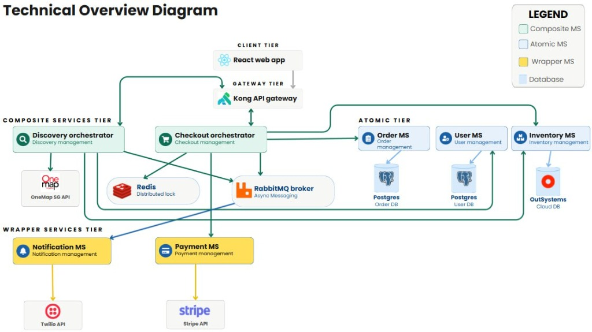

# ChompChomp

A microservices-based flash-sale food rescue platform that connects customers with daily discounted surplus food from local merchants.

> **IS213 Enterprise Solution Development — AY25/26 Semester 2**

---

## Table of Contents

- [Overview](#overview)
- [Architecture](#architecture)
- [Tech Stack](#tech-stack)
- [Prerequisites](#prerequisites)
- [Getting Started](#getting-started)
- [Services](#services)
- [External Services](#external-services)

---

## Overview

ChompChomp is a platform that connects consumers with daily surplus food from restaurants at discounted prices. The platform addresses the real-world problem of commercial food waste in Singapore by creating a marketplace where merchants can list unsold food and consumers can purchase them before they go to waste.  


---

## Architecture

### Technical Overview Diagram


ChompChomp follows a **4-layer Service-Oriented Architecture (SOA)**:

### UI Layer
| Component | Description |
|---|---|
| React Web App (Vite) | Frontend served at `http://localhost:5173`. All API calls route through Kong. |

### Composite Services Layer
Orchestrate multiple atomic/wrapper services to fulfil complex business workflows.

| Service | Port | Responsibility |
|---|---|---|
| `discovery_orchestrator` | 5010 | Tiered listing discovery, GraphQL marketplace API, calls `geocoding-ms` |
| `checkout_orchestrator` | 5011 | Redis locking, stock reservation, payment coordination |
| `notification_orchestrator` | 5012 | RabbitMQ tiered notification routing, post-TTL stock verification |

### Atomic Services Layer
Manage core data entities with exclusive access to their own data store.

| Service | Port | Responsibility |
|---|---|---|
| `user_ms` | 5006 | User & merchant account management, uses `geocoding-ms` (PostgreSQL) |
| `order_ms` | 5002 | Order history persistence (PostgreSQL) |
| OutSystems Inventory MS | (External) | Food item listings & stock management (OutSystems Cloud DB) |

### Wrapper Services Layer
Thin wrappers around external third-party APIs, exposing them as internal microservices.

| Service | Port | Wraps |
|---|---|---|
| `geocoding_ms` | 5007 | OneMap SG Search API (Postal code to Lat/Long) |
| `payment_ms` | 5003 | Stripe PaymentIntent API |
| `alert_ms` | 5004 | Twilio SMS API |

### Infrastructure
| Component | Role |
|---|---|
| **Kong API Gateway** | Single entry point for all frontend traffic (port 8000) |
| **PostgreSQL** | Persistent relational database (isolated schema per service) |
| **Redis** | Distributed locking & 60-second reservation sessions |
| **RabbitMQ** | Asynchronous messaging with TTL/DLQ tiered notification pattern |

---

## Tech Stack

- **Backend:** Python, Flask, Gunicorn
- **Frontend:** React (Vite), JavaScript
- **Database:** PostgreSQL
- **Messaging:** RabbitMQ (TTL + Dead Letter Queue pattern)
- **Cache / Locks:** Redis
- **API Gateway:** Kong
- **External APIs:** Stripe, Twilio, OneMap SG
- **Containerisation:** Docker, Docker Compose
- **API Protocols:** REST (HTTP) + GraphQL (Graphene)

---

## Prerequisites

- [Docker Desktop](https://www.docker.com/products/docker-desktop/) (with Docker Compose)
- [Node.js](https://nodejs.org/) (v18+)
- A `.env` file in the project root (see [Environment Variables](#environment-variables))

---

## Getting Started

### 1. Clone the Repository

```bash
git clone https://github.com/ongjianyong/ChompChomp.git
cd ChompChomp
```

### 2. Configure Environment Variables

Copy the example and fill in your credentials:

```bash
cp .env.example .env
```

### 3. Start the Backend

From the project root, run all microservices and infrastructure with:

```bash
docker compose up --build -d
```

This starts Kong, PostgreSQL, Redis, RabbitMQ, and all microservices.

### Database Persistence (Local)

PostgreSQL data is stored in the Docker named volume `postgres_data` (resolved by Docker Compose to a project-scoped name such as `chompchomp_postgres_data`).

- View volume names:

```bash
docker volume ls
```

- Inspect exact local mountpoint:

```bash
docker volume inspect <your_postgres_volume_name>
```

On Docker Desktop for Windows, this volume is managed inside Docker's Linux VM/WSL storage.

### Fresh Start Reliability

This repository includes an idempotent Postgres bootstrap step (`postgres-bootstrap`) that runs on every startup and ensures:

- `order_user` and `user_user` roles exist
- `order_db` and `user_db` databases exist

This prevents first-run failures for `user-ms` and `order-ms` on new machines.

If someone has a stale or broken local volume, run a clean reset:

```bash
docker compose down -v
docker compose up --build -d
```

### 4. Start the Frontend

```bash
cd frontend
npm install
npm run dev
```

### 5. Access the App

Open your browser and go to:

```
http://localhost:5173
```

All backend API traffic is routed through Kong at `http://localhost:8000`.

---

## Services

| Service | Internal URL | Kong Route |
|---|---|---|
| Discovery Orchestrator | `discovery-orchestrator:5010` | `/api/v1/discovery`, `/graphql` |
| Checkout Orchestrator | `checkout-orchestrator:5011` | `/api/v1/checkout` |
| Notification Orchestrator | `notification-orchestrator:5012` | — (RabbitMQ Consumer) |
| User MS | `user-ms:5006` | `/api/v1/users` |
| Order MS | `order-ms:5002` | `/api/v1/orders` |
| Geocoding MS | `geocoding-ms:5007` | — (Internal) |
| Payment MS | `payment-ms:5003` | `/api/v1/payments` |
| Alert MS | `alert-ms:5004` | `/api/v1/alert` |
| RabbitMQ Dashboard | `localhost:15674` | — |

---

## External Services

| Service | Provider | Purpose |
|---|---|---|
| Inventory MS | OutSystems | Cloud-hosted food item inventory (atomic service) |
| Payment | Stripe | Secure card processing via PaymentIntent API |
| SMS Alerts | Twilio | SMS delivery (wrapped by `alert-ms`, orchestrated by `notification-orchestrator`) |
| Geocoding | OneMap SG | Postal code to coordinates (wrapped by `geocoding-ms`) |

